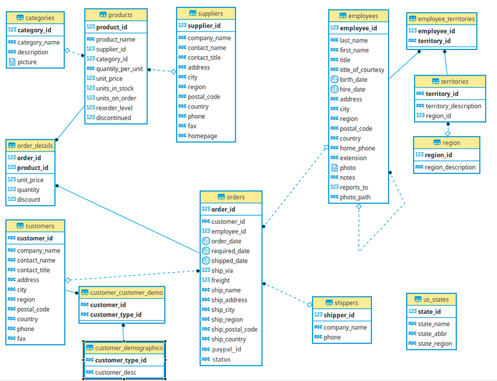
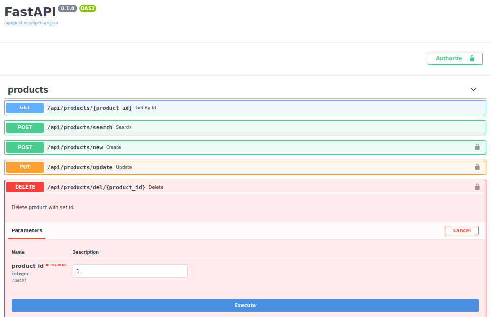
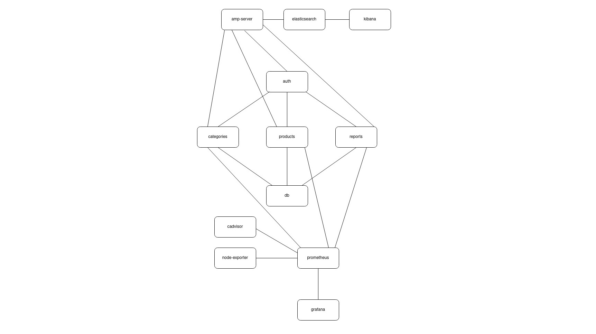
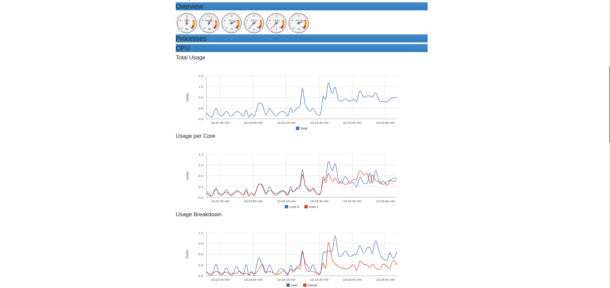
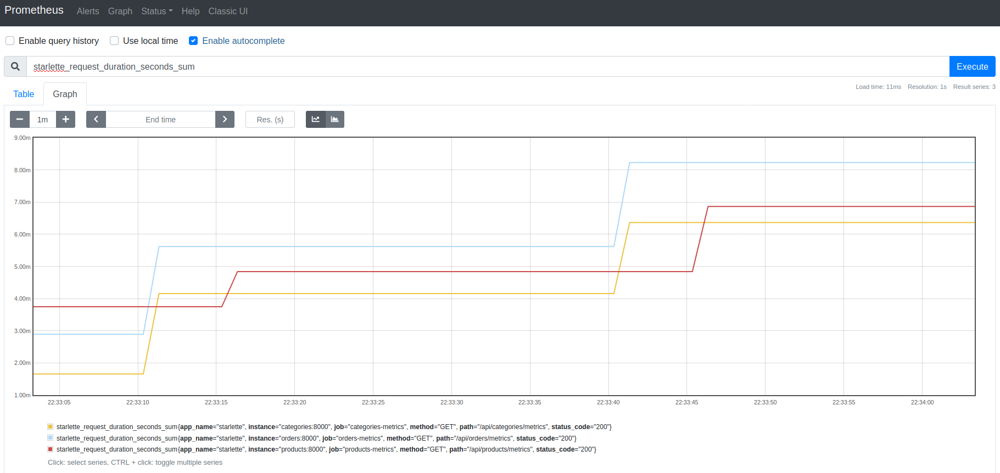
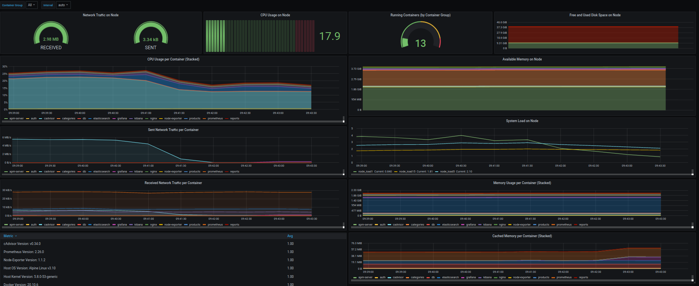
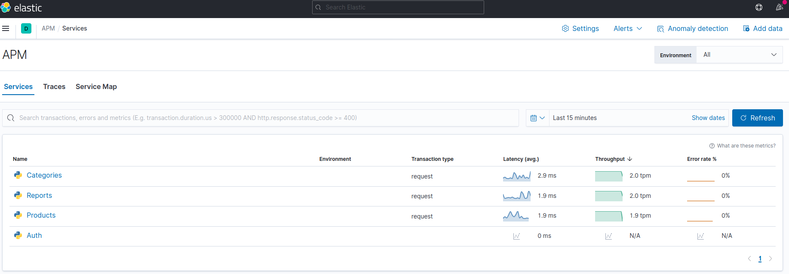

# Mikroserwisowa aplikacja do łączenia się z bazą "Northwind" w oparciu o PostgreSQL oraz FastAPI



### Struktura projektu

Główny folder zawiera pliki niezbędne do stworzenia bazy [northwind.sql](northwind.sql), na której będziemy operować 
oraz przygotowania środowiska pracy. Znajdziemy w nim pliki konfiguracyjne takie jak: [docker-compose.yml
](docker-compose.yml) umożliwiający dostosowanie kontenerów czy [nginx_config.conf](nginx_config.conf) odpowiedzialny 
za ustawienia serwera. W katalogu secrets znajdują się pliki z sekretami używanymi w docker-compose (umieszczone dla
wygody by nie wgrywać ich ręcznie po pobraniu projektu), ale ze względów bezpieczeństwa w wersji dla użytkownika 
lepiej usunąć zawartość tego katalogu przy wcześniejszym skopiowaniu skryptu .sh w nim umieszczonego, który można 
uruchamiać lokalnie by dodać sekrety (wymaga to lekkiej modyfikacji pliku docker-compose).

Serwisy komunikujące się z bazą danych są dodane w odpowiednich folderach, przykładowo `auth-service`, a kod dla nich 
wspólny umieszczony jest w katalogu common.

Pliki konfiguracyjne dla Prometheusa oraz Grafany znajdują się w katalogach o nazwie danej usługi.

### Uruchomienie

Wymagana jest wcześniejsza instalacja [dockera](https://www.docker.com/get-started) oraz 
[docker-compose](https://docs.docker.com/compose/install/). Następnie wykonujemy kolejno komendy w terminalu:

```
git clone https://github.com/ethru/northwind_psql.git
cd northwind_psql
docker-compose up
```

Po wykonaniu powyższych czynności jesteśmy w stanie komunikować się z naszym api za pomocą przeglądarki. By zobaczyć 
dokumentację oraz przetestować działanie danego serwisu należy przejść pod adres 
`http://0.0.0.0:8080/api/nazwa-serwisu/docs`.

*Uwaga:* jeśli żaden z serwisów nie jest dostępny przy pierwszym uruchomieniu `docker-compose'a`. Należy zatrzymać go 
`CTR+C` i wywołać komendę ponownie.

### Serwisy

- http://0.0.0.0:8080/api/categories/docs
- http://0.0.0.0:8080/api/products/docs
- http://0.0.0.0:8080/api/reports/docs

### Endpointy



Do testowania poszczególnych serwisów zaleca się korzystanie z UI Swaggera (zdjęcie powyżej). By przykładowo wysłać 
zapytanie `DELETE` naciskamy kolejno `Try it out` i po wprowadzeniu id produktu `Execute`. Kiedy obok adresu widnieje 
kłódka niezbędne jest zalogowanie by skorzystać z danej funkcjonalności.

### Autoryzacja

Niektóre endpointy zabezpieczone są przed niepowołanym dostępem. Mogą z nich korzystać wyłącznie osoby znające 
login oraz hasło. Po naciśnięciu kłódki widocznej w prawym górnym rogu zdjęcia można wprowadzić nagłówek służący do 
autoryzacji.

Nagłówek można przykładowo wygenerować za pomocą 
[tego narzędzia](https://www.blitter.se/utils/basic-authentication-header-generator/). Domyślnie jest to Username: admin
, Password: password . Co daje nagłówek `Basic YWRtaW46cGFzc3dvcmQ=`. Dane logowania można edytować w plikach sekretów.

### Komunikacja

Komunikacja między usługami aplikacji wygląda w następujący sposób:



### Monitorowanie

Wykorzystane zostały następujące narzędzia:

- cAdvisor
  - http://0.0.0.0:9000/containers/



- Prometheus
  - http://0.0.0.0:9001/graph
  


- Grafana
  - http://0.0.0.0:9002/login (login: admin , password: password)



- Kibana
  - http://0.0.0.0:9004/app/apm



By przesyłać odpowiednie dane z serwisu użyta została metoda `add_middleware`. Przykład z pliku `main.py` umieszczonego 
w [categories-service/app](categories-service/app/main.py):

```python
from elasticapm.contrib.starlette import ElasticAPM
from starlette_exporter import PrometheusMiddleware, handle_metrics

...

app = FastAPI(openapi_url="/api/categories/openapi.json", docs_url="/api/categories/docs")
app.add_middleware(PrometheusMiddleware)
app.add_route("/api/categories/metrics", handle_metrics)

app.add_middleware(ElasticAPM, client=apm)
```

Każdy z endpointów został udekorowany `@request_metrics.time()` by zapewnić dane dla Prometheus'a. Natomiast dla Kibany 
użyta była metoda `capture_message(...)`. Poniżej przykład z 
[serwisu kategorii](categories-service/app/api/categories.py):

```python
from elasticapm.contrib.starlette import make_apm_client
from fastapi import APIRouter, Depends, File, UploadFile, HTTPException
from prometheus_client import Summary

...

request_metrics = Summary('request_processing_seconds', 'Time spent processing request')

apm = make_apm_client({'SERVICE_NAME': 'Categories', 'SERVER_URL': getenv('APM_URL')})

...

@request_metrics.time()
@categories.get('/all', response_model=List[CategoryOut])
async def get_all():
    """Return all categories stored in database."""
    apm.capture_message('All categories returned.')
    return await db.get_categories()

```

### Realizacja

- Kamil Gliński
- Adrian Nieć
